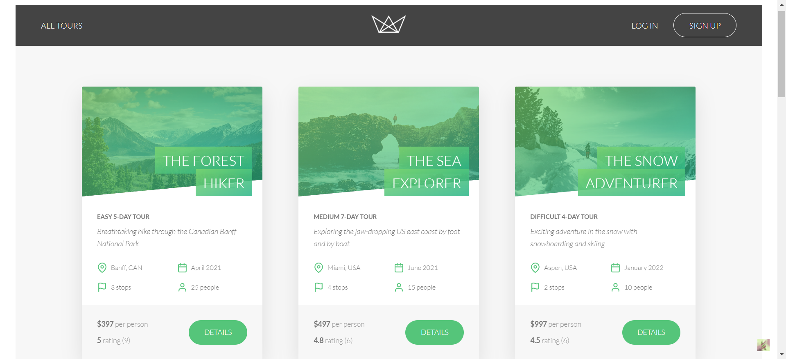
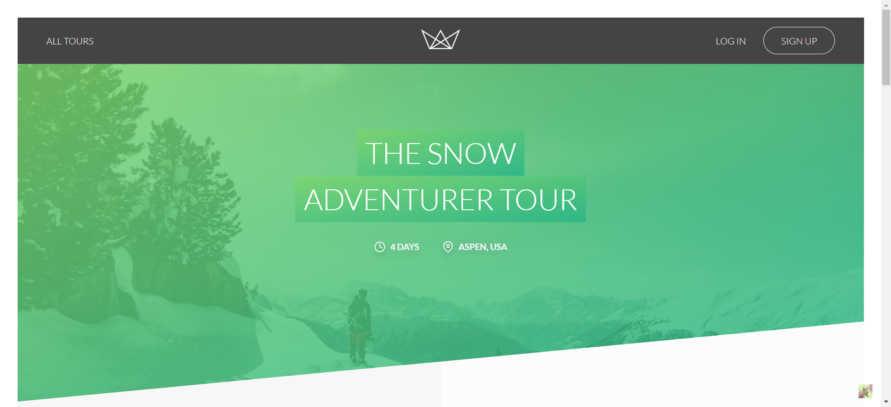

# Natours Web Application

## Overview

Natours is a full-stack web application that empowers users to book tours effortlessly. It provides a seamless experience for users to explore and book various tours, leveraging modern technologies for a robust and scalable solution.

## Features

- **Express.js Backend**: Built with Express.js, Natours offers a robust backend with over 30 distinct RESTful APIs and 5 subscription services.
- **MongoDB Database**: Hosted on the cloud using Atlas, Natours ensures secure and scalable database management, tested with MongoDB Compass. Mongoose is utilized for seamless interaction with the remote database.
- **Interactive Geographic Demonstration**: Incorporating Mapbox APIs, Natours offers an interactive geographic demonstration for users to explore tour destinations visually.
- **Online Credit Card Payment System**: Integrated with Stripe, Natours facilitates secure online credit card payments for tour bookings.
- **Responsive Design**: Natours is designed to be responsive, ensuring a seamless experience across various devices and screen sizes.

## Technologies Used

- Node.js
- Express.js
- MongoDB
- Mongoose
- Mapbox APIs
- Stripe
- HTML, CSS, JavaScript
- Pug (formerly Jade) templating engine

## Visual Overview

### You can browse different tours.

### You can check out the geographical information powered by Mapbox API, and book tour with Stripe.

## Installation

1. Clone the repository: `git clone https://github.com/your_username/natours.git`
2. Navigate to the project directory: `cd natours`
3. Install dependencies: `npm install`
4. Set up environment variables: Create a `.env` file based on the provided `.env.example` and fill in the necessary values.
5. Start the application:
   - Development mode: `npm run dev`
   - Production mode: `npm start`

## Usage

Once the application is running, users can access the Natours web application through their web browser. They can browse available tours, view details, and book tours seamlessly. The interactive geographic demonstration allows users to explore tour destinations visually, while the online credit card payment system facilitates secure transactions.

## Deployment

Natours is deployed and hosted on the Heroku cloud platform for seamless access and scalability.

## Testing

- **Postman**: The APIs are thoroughly tested using Postman to ensure functionality and reliability.

## Contributing

Contributions are welcome! If you find any bugs or have suggestions for improvements, feel free to open an issue or submit a pull request.

1. Fork the repository.
2. Create your feature branch (`git checkout -b feature/YourFeature`).
3. Commit your changes (`git commit -am 'Add some feature'`).
4. Push to the branch (`git push origin feature/YourFeature`).

Your feedback and contributions are greatly appreciated!!
